# Technical Documentation

**Language:** English | [中文](TECHNICAL.zh-CN.md)

This document is about **implementation technology**: the crates `jir` is built on,
its internal mechanisms, the algorithms it runs, and the invariants its code relies
on. It deliberately does not describe how to *use* the tool — command syntax,
aliases, examples and workflows belong in [`README.md`](README.md), and build steps
in [`BUILD.md`](BUILD.md).

## 1. Technology Stack

| Crate | Version | Role in the implementation |
| --- | --- | --- |
| `clap` | 4.6, `derive` | The CLI surface. The `Commands` enum (`src/cli.rs:28`) is the single declarative source of truth for subcommands, flags and help text. |
| `anyhow` | 1.0 | Error propagation. Every command returns `anyhow::Result<()>` and attaches context at the failure site. |
| `reqwest` | 0.13, `blocking` | HTTP for the index and for archive downloads. |
| `serde_json` | 1.0 | Index and metadata parsing. |
| `zip` | 8.6, `deflate-flate2` | Archive extraction (`src/commands/install.rs:210`). |
| `flate2` | 1, `rust_backend` | Compression backend. `zip`'s `deflate-flate2` feature only pulls the crate in, so the backend is selected explicitly (`Cargo.toml:16`). |
| `indicatif` | 0.18 | Progress bars for download and extraction. |
| `dialoguer` | 0.12 | The interactive vendor pickers in `prompt.rs`. |
| `colored` | 3.1 | Styling for list and status output. |
| `terminal_size` | 0.4 | Terminal width, used to compute the listing column count. |
| `junction` | 2.0 | Windows directory junctions. |

Two decisions shape everything else:

- **Synchronous throughout; there is no async runtime.** `reqwest` is used in
  `blocking` mode (`src/jdk.rs:244`, `src/commands/install.rs:134`). The process is
  short-lived and waits on at most one download, so an executor would add
  lifetimes and dependency weight without buying any usable concurrency.
- **Dynamic JSON instead of typed structs.** The index is read as
  `serde_json::Value` through `as_str()` / `as_u64()` accessors (`src/jdk.rs:162`).
  A field added to the index therefore needs no deserialization change, and a
  malformed entry degrades to a default value rather than failing the whole parse.

## 2. Architecture

Dependencies point one way only: `cli` → `commands` → (`jdk`, `prompt`). `jdk.rs` is
the only module that constructs runtime paths, so no command module composes a path
from `JIR_HOME` on its own.

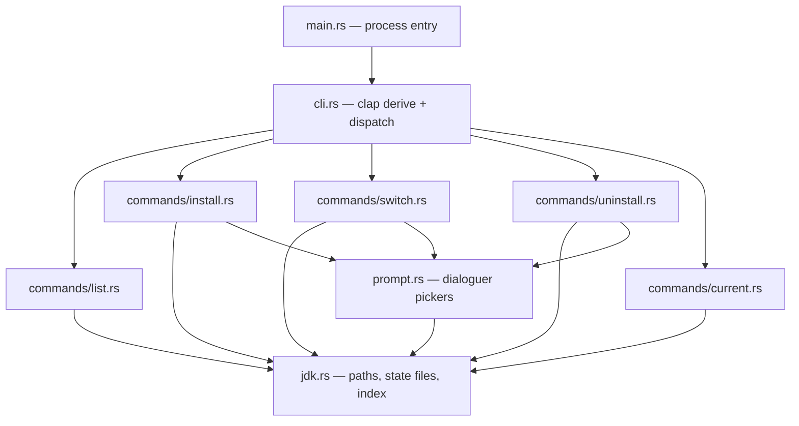

`src/main.rs:9` is the whole entry point — `cli::Cli::parse().run()`. Parsing,
dispatch and the `after_help` text all live in `src/cli.rs:73`, which is why adding
a command never touches `main.rs`.

Dispatch itself is thin: `Cli::run` maps one enum variant to one `run()` call
(`src/cli.rs:74`). The only logic there is that `install` asserts a non-empty spec
and then loops, invoking `install::run` once per spec (`src/cli.rs:81`) — so
multi-spec installs are sequential, not parallel, and the first failure aborts the
remaining ones.

## 3. Runtime State

### 3.1 Resolving the runtime home

`jdks_base()` (`src/jdk.rs:12`) resolves the base in this order:

1. `%JIR_HOME%`, if set;
2. otherwise `<directory of the running executable>/home`, falling back to `.` when
   the executable path cannot be determined (`src/jdk.rs:16`).

The value is recomputed on every call rather than cached in a global, so the
process has no initialisation order to get wrong. Because path 2 is derived from
`current_exe()` rather than a compiled-in constant, no absolute install path is ever
baked into the binary.

### 3.2 Layout

```text
<home>/
├── 21/
│   └── temurin/          installed JDK (a real directory)
├── 17/
│   └── zulu/
├── occupy              → junction/symlink to the active JDK   (occupy_dir)
├── .jir-current          marker: the active JDK spec           (current_marker)
├── .meta/
│   └── temurin-21.json   vendor/build metadata for one JDK
├── .tmp/
│   └── 21-temurin/       extraction staging, removed on success
└── installers/
    └── <file>.msi        downloaded non-zip archives, kept for manual install
```

| Path | Written by | Implementation note |
| --- | --- | --- |
| `<version>/<distro>/` | `install` | Its existence *is* the definition of "installed" — there is no registry file that could disagree with the filesystem. |
| `occupy` | `use` | The only path `JAVA_HOME` needs to reference (`src/jdk.rs:23`). |
| `.jir-current` | `use`; removed by `uninstall` | Deliberately a sibling of `occupy`, not a child, so activation never writes into a managed JDK (`src/jdk.rs:29`). |
| `.meta/<distro>-<version>.json` | `install`, `use` | Same-volume cache; lets `ls`/`use`/`current` resolve a vendor name without the index (`src/jdk.rs:120`). |
| `.tmp/<version>-<distro>/` | `install` | Sibling of the destination, so promotion is a same-volume `rename` (`src/commands/install.rs:198`). |
| `installers/<filename>` | `install` | Only reached when `archive_type != "zip"` (`src/commands/install.rs:60`). |

### 3.3 The marker file

`current_info()` (`src/jdk.rs:40`) reads `.jir-current` and, if that read fails,
falls back to the legacy `occupy/.jir-current` location that older builds wrote
inside the JDK (`src/jdk.rs:34`). The format is two lines:

```text
21:temurin
Temurin
```

The vendor line is optional. `parse_marker()` (`src/jdk.rs:47`) returns `None` for an
empty or whitespace-only first line, and yields `(spec, None)` when there is no
second line, which is how a marker written by an older build stays readable.
`clear_current()` (`src/jdk.rs:75`) removes both locations so an upgrade cannot leave
a stale legacy marker behind. Both reads are plain `read_to_string` calls — this is
the mechanism behind `jir current` never touching the network
(`src/commands/current.rs:22`).

### 3.4 Metadata records

`JdkMeta` (`src/jdk.rs:114`) is a two-field struct (`firm`, `java_version`) filled
from the `.meta` JSON. `read_meta()` returns `JdkMeta::default()` on a missing file
*or* on a JSON parse failure, so a corrupt record degrades to "unknown vendor"
instead of an error. `write_meta()` (`src/jdk.rs:140`) is explicitly best-effort: the
`Result` is discarded with `let _ =` (`src/jdk.rs:154`), because the only consequence
of a failed write is one later network lookup.

### 3.5 Index cache location

The index cache deliberately lives outside the runtime home so it still works when
the home directory is read-only, such as an install under `Program Files`
(`src/jdk.rs:186`). `cache_dir()` (`src/jdk.rs:188`) resolves:

| Condition | Location |
| --- | --- |
| `JIR_HOME` set | `$JIR_HOME/.cache` — an isolated runtime keeps its cache with it |
| Windows, `LOCALAPPDATA` set | `%LOCALAPPDATA%\jir` |
| Unix, `XDG_CACHE_HOME` set | `$XDG_CACHE_HOME/jir` |
| Unix, `HOME` set | `~/.cache/jir` |
| Fallback | `<temp>/jir` |

The file is `version-cache.json` (`src/jdk.rs:209`).

## 4. Core Mechanisms

### 4.1 A stable `JAVA_HOME` is an indirection, not a variable edit

The central mechanism: one directory link at `<home>/occupy`, re-pointed on every
switch. `JAVA_HOME` is configured once, by the user, to point at the link.

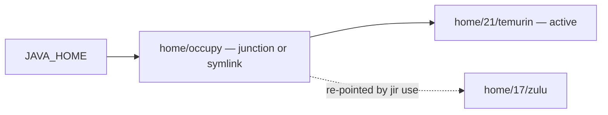

Because the switch is `junction::create` / `symlink` (`src/commands/switch.rs:125`)
rather than a copy, its cost is independent of JDK size. The trade-off is that the
tool now owns a filesystem object whose failure modes must be handled: a dangling
link, and a real directory left over from an older copy-based implementation. Both
are handled explicitly in §4.5.

### 4.2 Activation is a cutover with rollback

Remove-then-create is not atomic — there is a window where `occupy` does not exist.
The implementation therefore captures the previous target *before* unlinking, so it
can restore it if the new link cannot be created.

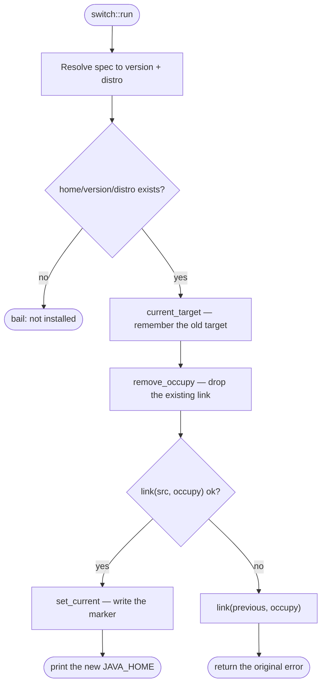

`current_target()` (`src/commands/switch.rs:83`) returns the path only if it still
exists, so the rollback never restores a link to something already deleted. The
restore is itself best-effort (`link(...).ok()` at `src/commands/switch.rs:50`): the
original error is what propagates, on the principle that the first failure is the
informative one.

### 4.3 Installation is stage-then-promote

The invariant is that a half-extracted JDK must never look installed. Since
"installed" means "the `<version>/<distro>` directory exists", extraction must
happen anywhere else and be promoted in one step.

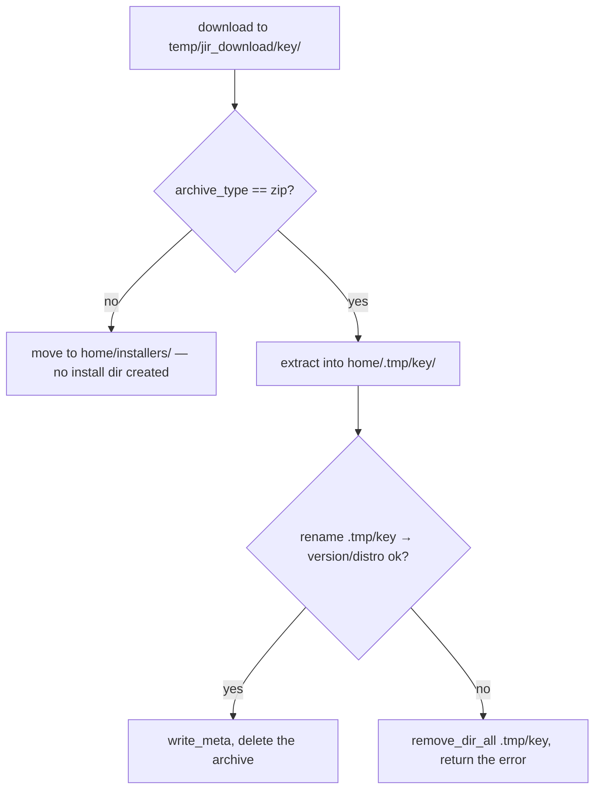

`install_zip()` (`src/commands/install.rs:194`) removes a pre-existing `.tmp/<key>`
before extracting, so a leftover from a killed process cannot merge into a new
extraction. Both the extraction and the `rename` are inside one `and_then` chain
(`src/commands/install.rs:203`), which means a *promotion* failure also triggers the
staging-directory cleanup, not just an extraction failure.

The staging key is `<version>-<distro>` (`work_key`, `src/commands/install.rs:123`).
Keying on the distro alone would let a concurrent `17:temurin` and `21:temurin`
installation share a directory; keying on both keeps residual directories from an
interrupted run identifiable.

### 4.4 Download is streaming, bounded, and restartable

JDK archives are 100–200 MB, so a dropped connection must not mean starting over.
The retry loop is bounded at three attempts and deletes the partial file between
them, so a resumed attempt cannot append to a truncated prefix.

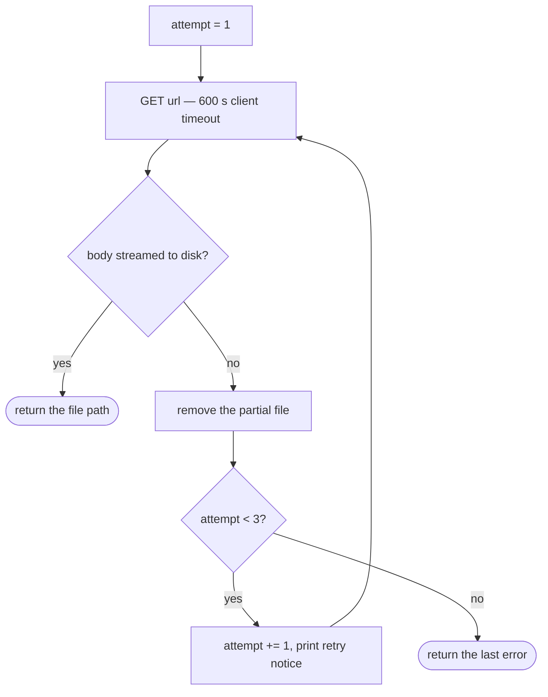

The body is copied in 64 KiB chunks (`src/commands/install.rs:168`) rather than read
whole, so memory use is constant regardless of archive size, and the progress bar is
advanced per chunk. The client timeout is deliberately long — 600 s
(`src/commands/install.rs:135`) — versus the 20 s used for the index
(`src/jdk.rs:245`), because the two requests differ by two orders of magnitude in
payload. `fetch_body` clears the progress bar on every exit path
(`src/commands/install.rs:162`) so a failure never leaves a half-drawn row on screen.

An `msi`/`exe` archive takes a different branch: it is moved to
`home/installers/<filename>` and the install directory is deliberately **not**
created (`src/commands/install.rs:56`). Nothing can extract it headlessly, so the
alternative — treating "downloaded an installer" as "installed a JDK" — would make
`ls` and `use` report a JDK that does not exist on disk.

### 4.5 Unlinking has to distinguish a link from a directory

`remove_link_or_dir()` (`src/commands/switch.rs:111`) exists because older builds
implemented switching by copying a real directory into place. Calling
`remove_dir_all` on a junction would delete the *target's contents*; calling
`remove_dir` on a real directory fails. The gate is `junction::exists()`
(`src/commands/switch.rs:114`): a junction is dropped with `remove_dir`, which
removes the reparse point only, and anything else is treated as a legacy real
directory and removed recursively.

### 4.6 Zip extraction: wrapper stripping

Vendor archives usually wrap everything in one versioned directory
(`jdk-21.0.11+10/`). Detecting it requires care: stripping the prefix when some
entries live at the root would silently scatter the tree.

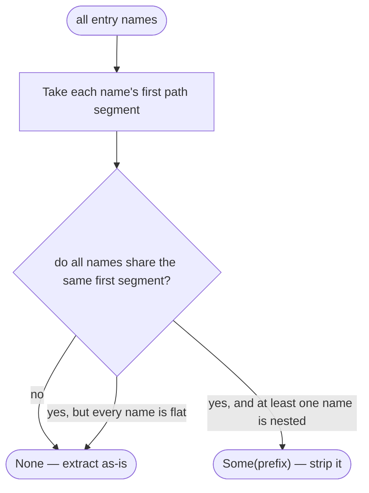

The `nested` flag (`src/commands/install.rs:266`) is what separates "one wrapper
directory" from "a single root-level file", which is also why an empty name list
yields `None`. Entry names are normalized from `\` to `/` before the check
(`src/commands/install.rs:220`), because zip entries do not consistently use forward
slashes. Stripping is applied per entry and falls back to the raw name when the
prefix does not match (`src/commands/install.rs:233`).

### 4.7 Zip extraction: path hardening

Entry names are untrusted input. `safe_relative()` (`src/commands/install.rs:293`)
rebuilds each name component by component instead of validating the string, so it
does not depend on spotting a particular syntax.

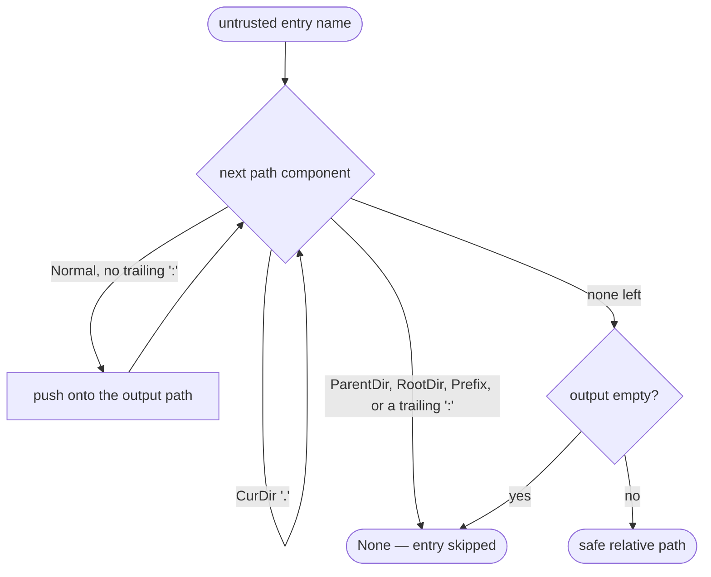

Two details are deliberate. `CurDir` is skipped rather than rejected, because
`./a/b` is a legitimate entry name; and `foo..bar` is accepted, because `..` is only
dangerous as a whole component — the check is on `Component::ParentDir`, not on the
substring. The trailing-colon test (`src/commands/install.rs:301`) catches
drive-relative prefixes such as `C:` on every platform, not only on Windows, so the
guarantee does not depend on which OS is compiling the crate. A rejected entry is
skipped rather than fatal, and the final empty-output check rejects names that reduce
to nothing.

### 4.8 "Installed" is discovered, never recorded

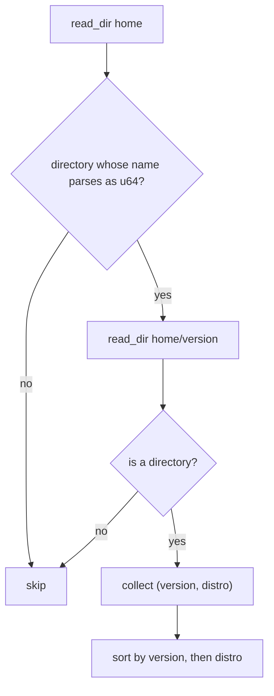

`installed_specs()` (`src/jdk.rs:85`) scans two levels and filters version directories
by a successful `parse::<u64>()` (`src/jdk.rs:93`). That single line is what makes the
directory the only source of truth: `.meta`, `.tmp`, `installers` and `occupy` all
fail the numeric parse and are skipped, and a partially written directory is either
present in full or absent. Failures are absorbed rather than propagated — a missing
base directory returns an empty vector (`src/jdk.rs:88`). `installed_keys()`
(`src/jdk.rs:105`) projects the same data into a `HashSet<String>` of
`<distro>-<version>` keys, which is the shape the listing and the pickers need for
`O(1)` membership tests.

### 4.9 Metadata resolution is offline-first

Vendor and build numbers are needed for display, but fetching them must not be
required to activate a JDK.

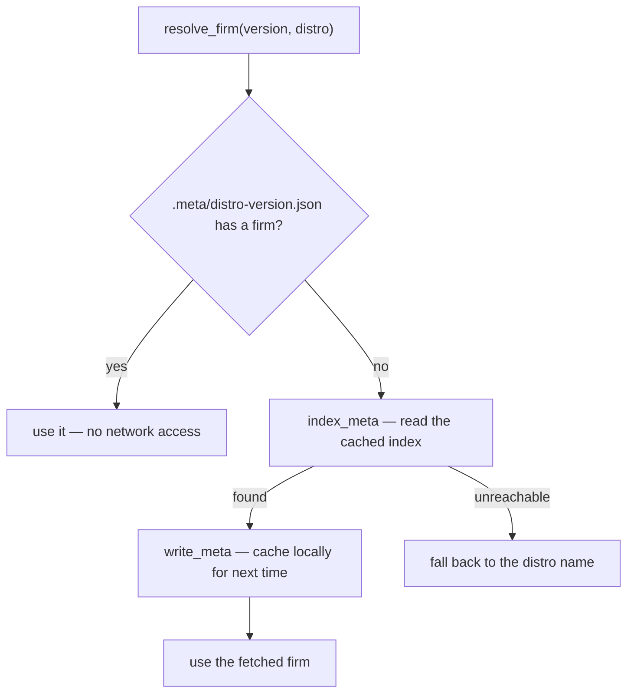

`resolve_firm()` (`src/commands/switch.rs:69`) tries local metadata first, so anything
this build installed activates with zero network access. Only a JDK that predates the
metadata file falls back to the index, and that result is written back
(`src/commands/switch.rs:75`), so the cost is paid at most once per JDK. The final
fallback is the distro string itself, which means an offline activation still
succeeds even when the index is unreachable.

### 4.10 Index loading is a three-tier cache

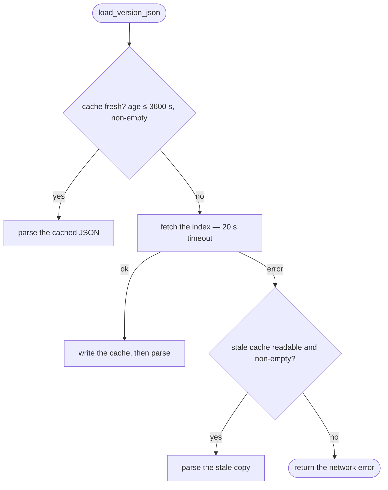

`load_version_json()` (`src/jdk.rs:213`) is the mechanism that makes `ls -i` and
`install` degrade gracefully offline. Tier 1 is a freshness check: `fresh_cache()`
(`src/jdk.rs:235`) requires the file's mtime to be within `VERSION_CACHE_TTL`
(3600 s, `src/jdk.rs:8`) *and* the content to be non-empty — an empty file is treated
as a miss, which is why a truncated write from an interrupted process cannot poison
the cache. Tier 3 is the interesting one: on a network error the stale copy is used
**even though it is expired** (`src/jdk.rs:227`), on the judgement that a
possibly-outdated index is more useful than a hard failure. Only when there is no
usable copy at all does the original network error surface. Cache writes are
best-effort `let _ =` (`src/jdk.rs:222`), so a read-only cache directory does not
break the command.

## 5. Index Pipeline

### 5.1 Producer side

`bat/version.json` in the repository is the source file published to the URL the
client reads (`src/jdk.rs:6`). `bat/update_version_json.py` regenerates it.

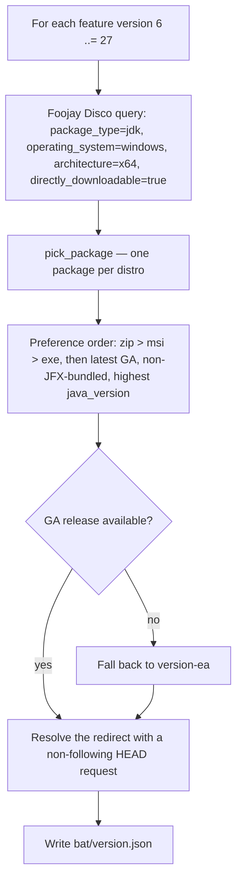

Resolving the redirect at generation time is what lets the client store a direct
download URL and skip a round trip per install.

### 5.2 Schema and lookup

Top level (`generated_at`, `source`, `platform`, `architecture`, `package_type`,
`selection`, `packages`), then one object per package:

| Field | Type | Used for |
| --- | --- | --- |
| `version` | number | Exact match against the requested feature version. |
| `distro` | string | Vendor key; matched case-insensitively. |
| `firm` | string | Display name, persisted into `.meta`. |
| `java_version` | string | Build string, persisted into `.meta` and shown in listings. |
| `filename` | string | Name of the file written during download. |
| `archive_type` | string | Selects the extraction path vs. the `installers/` branch. |
| `url` | string | Direct download URL. |
| `release_status` | string? | `"ea"` for early-access entries; informational only. |

`find_package()` (`src/jdk.rs:162`) is a linear scan comparing `version` exactly and
`distro` with `eq_ignore_ascii_case` (`src/jdk.rs:171`). The linear scan is
deliberate: the index holds a few hundred entries and is read once per command, so an
index structure would be premature. `install.rs` reads the matched object field by
field with `unwrap_or` defaults (`src/commands/install.rs:28`), so a package missing,
say, `archive_type` is still installable as a zip.

## 6. Command Implementation

Only the control flow and entry points are described here; see `README.md` for the
user-facing syntax.

### 6.1 `list`

`list::run` (`src/commands/list.rs:9`) branches into two entirely separate
implementations that share only the rendering step:

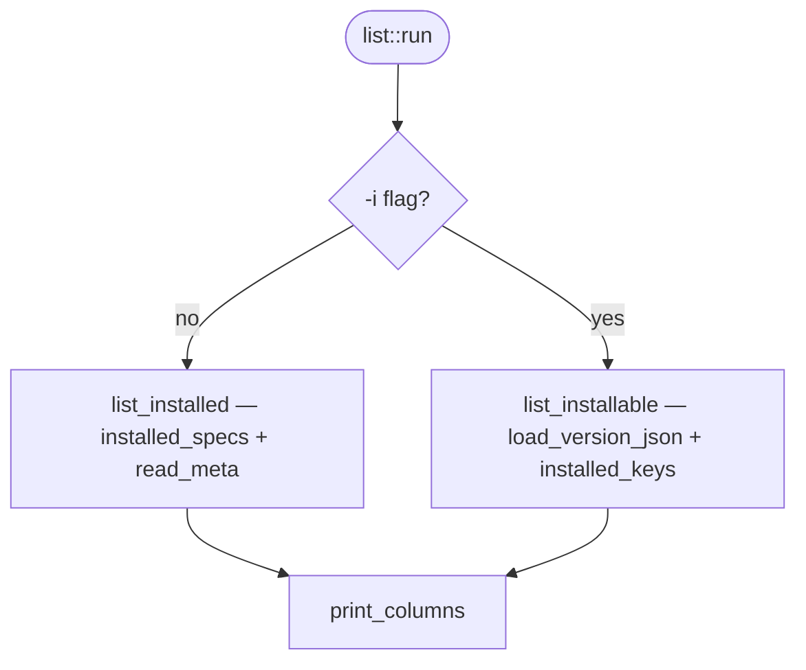

The installed branch only touches the filesystem; the installable branch only
touches the index plus the locally derived installed set. State is encoded as three
distinct glyphs — `*` active, `+` installed but inactive, blank not installed
(`src/commands/list.rs:42`) — chosen so the listing stays readable without color.

The layout is computed, not hardcoded (`src/commands/list.rs:113`): the column width
is the longest label plus two, the column count is `terminal_width / column_width`
with a floor of 1, and a width of 80 is assumed when `terminal_size()` returns
nothing (`src/commands/list.rs:117`). Because the count is derived from the width,
the output degrades to a single column in a narrow terminal instead of wrapping.

### 6.2 `install`

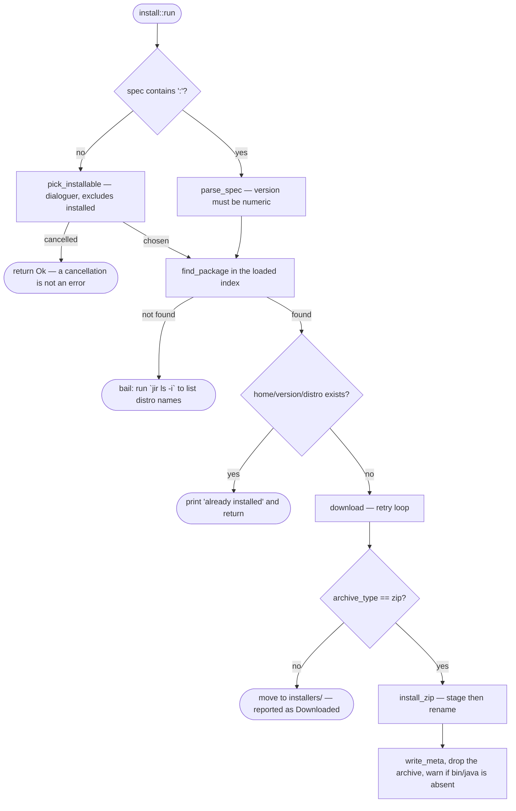

Two early exits carry the design intent. The `dest_dir.exists()` check comes
*before* any network access (`src/commands/install.rs:36`), so reinstalling an
existing JDK costs nothing and re-running a failed script is safe. And a cancelled
picker returns `Ok(())` rather than an error, so cancellation is distinguishable from
a failure by exit code alone (`src/commands/install.rs:18`).

`pick_installable()` (`src/prompt.rs:8`) filters the index by version and then by
`installed_key` membership, so already-installed vendors never appear as choices;
when the filter empties the list it bails instead of showing an empty prompt
(`src/prompt.rs:29`). The pickers use `interact_opt()`, whose `None` result is the
cancellation signal that all three call sites test.

### 6.3 `use`

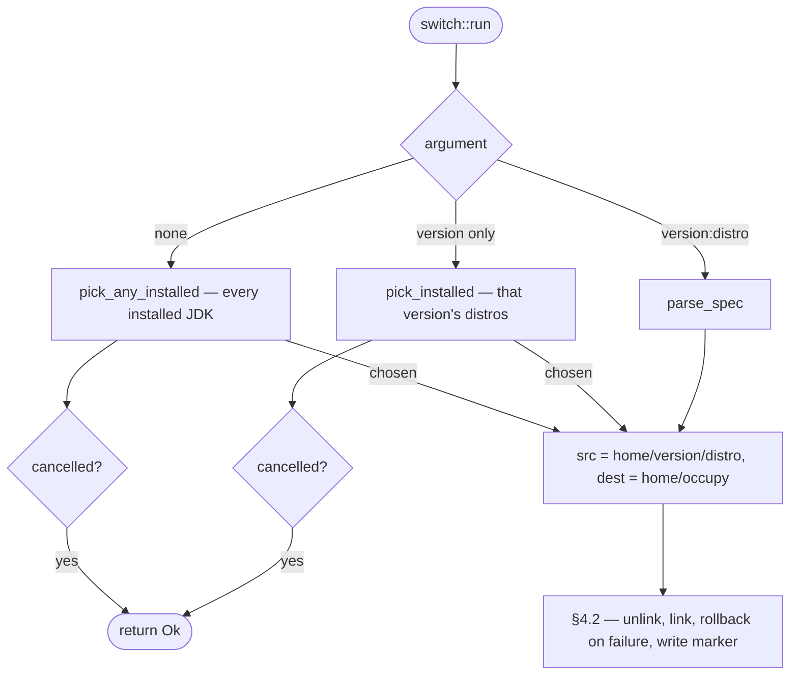

`pick_installed()` (`src/prompt.rs:48`) returns the single candidate directly without
prompting when only one distro exists for a version (`src/prompt.rs:64`), so the
common single-JDK case stays non-interactive. `pick_any_installed()` does the same
(`src/prompt.rs:87`).

### 6.4 `uninstall`

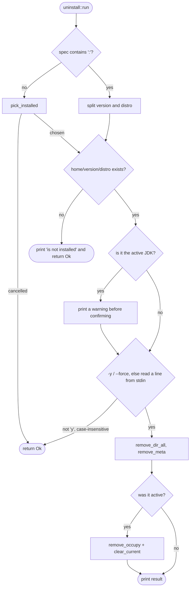

Deleting something absent is reported as an informational message and `Ok(())`
(`src/commands/uninstall.rs:29`) — it is idempotent, not an error. The confirmation
requires an explicit `y` with the comparison using `eq_ignore_ascii_case`
(`src/commands/uninstall.rs:52`), so a bare Enter cancels. When the removed JDK was
active, both the link and the marker are cleared (`src/commands/uninstall.rs:64`) —
the marker is dropped rather than rewritten, which makes `JAVA_HOME` point at a
non-existent path, which is the intended "unset" state, and `current` then reports no
active JDK.

### 6.5 `current`

`current::run` (`src/commands/current.rs:6`) is a read-only projection of local
state: marker → metadata → path resolution. The vendor falls back through
marker → `.meta` → distro name (`src/commands/current.rs:24`), the `bin/java` check
uses `cfg!(windows)` to pick the extension (`src/commands/current.rs:21`), and a
missing binary is *reported* rather than treated as an error
(`src/commands/current.rs:40`) — the command's job is to describe the current state,
including a broken one.

## 7. Error Model

Every command returns `anyhow::Result<()>`, and `main` returns it too, so a failure
surfaces as `Error: <context>` on stderr with a non-zero exit status. Context is
attached at the site that knows the most: `parse_spec` names the expected format,
`find_package` points at the index listing, and `switch::run` points at the installed
listing (`src/commands/switch.rs:32`).

Three classes of condition are deliberately *not* errors, and all three return
`Ok(())`:

| Condition | Rationale |
| --- | --- |
| Interactive selection cancelled | The user's intent, not a failure (`src/commands/install.rs:18`, `src/commands/switch.rs:13`). |
| Package already installed | Re-running is safe and should be a no-op (`src/commands/install.rs:36`). |
| Uninstalling something absent | Already in the desired state (`src/commands/uninstall.rs:29`). |

Conversely, several writes are deliberately best-effort and swallow their errors —
`.meta` writes (`src/jdk.rs:154`), cache writes (`src/jdk.rs:222`), and the rollback
re-link (`src/commands/switch.rs:50`). In each case the failure of the auxiliary step
does not invalidate the primary outcome, and surfacing it would turn a successful
command into a failed one.

## 8. Test Strategy

Tests are inline `#[cfg(test)]` modules next to the code they cover, and they target
pure functions rather than behaviour on disk:

| Location | Functions under test |
| --- | --- |
| `src/jdk.rs:256` | `installed_key` shape; `parse_marker` including the vendor-less legacy form and the whitespace-only rejection; `fresh_cache` rejecting missing, empty and fresh files. |
| `src/commands/install.rs:313` | `parse_spec`; `safe_relative` traversal table — including the `foo..bar` acceptance and the `C:/…` rejection; `work_key` uniqueness per version *and* distro; `shared_wrapper` for the wrapper, mixed-root, single-flat-file and empty cases. |
| `src/commands/switch.rs:139` | `parse_spec` requiring a distro and tolerating whitespace. |

The selection follows from what actually can break: the path-safety rules, the
marker's backward compatibility, the wrapper-stripping decision and the staging key
are the pieces where a wrong answer is silent and destructive. Everything else is
I/O composition that the type system and the compiler already constrain.

## 9. Platform Gates

| Concern | Windows | Unix |
| --- | --- | --- |
| Link creation | `junction::create` (`src/commands/switch.rs:128`) | `std::os::unix::fs::symlink` (`src/commands/switch.rs:133`) |
| Link detection | `junction::exists` before unlinking (`src/commands/switch.rs:114`) | No equivalent; the path is treated as a real directory |
| Binary check | `bin/java.exe` (`src/commands/current.rs:21`) | `bin/java` |
| Cache directory | `%LOCALAPPDATA%\jir` (`src/jdk.rs:194`) | `$XDG_CACHE_HOME/jir`, else `~/.cache/jir` |

Divergence is confined to `#[cfg(...)]` blocks inside three functions, so the command
and state logic above is platform-independent. One deliberate exception: the
trailing-colon rejection in `safe_relative` is *not* gated, so the archive-safety
guarantee is identical on both platforms even though only one of them has drive
letters.

The index itself is generated for Windows x64 only (`platform` / `architecture` in
`version.json`), which is why the archive-type branch is written around Windows
installers.

## 10. Extension Points

- **A new vendor** requires no code change: it appears once
  `bat/update_version_json.py` collects it and the regenerated `version.json` is
  published. The `distro` value becomes the spec suffix automatically.
- **A new archive format** is a change in `install.rs`: turn the
  `archive_type != "zip"` branch (`src/commands/install.rs:56`) into a real extraction
  path, keeping the stage-then-promote pattern so a partial extract is never
  discoverable as installed.
- **A new command** is a variant on `Commands` (`src/cli.rs:28`), a module with a
  `run()` under `src/commands/`, and one arm in `Cli::run` (`src/cli.rs:74`).
  `main.rs` never changes.
- **A new state field** belongs in `.meta` rather than a new file: `read_meta` /
  `write_meta` already tolerate unknown and missing keys.
