# 技术文档

**文档语言：** 中文 | [English](TECHNICAL.md)

本文讲的是 **实现技术**：`jir` 建立在哪些 crate 之上、内部机制如何运作、用到哪些算法、代码依赖哪些不变量。它刻意不描述工具**怎么用**——命令语法、别名、示例与工作流见 [`README.zh-CN.md`](README.zh-CN.md)，构建步骤见 [`BUILD.zh-CN.md`](BUILD.zh-CN.md)。

## 1. 技术栈

| Crate | 版本 | 在实现中的角色 |
| --- | --- | --- |
| `clap` | 4.6，`derive` | CLI 表面。`Commands` 枚举（`src/cli.rs:28`）是子命令、参数与帮助文本唯一的声明式来源。 |
| `anyhow` | 1.0 | 错误传播。每个命令返回 `anyhow::Result<()>`，并在失败点附加上下文。 |
| `reqwest` | 0.13，`blocking` | 索引与归档下载的 HTTP 客户端。 |
| `serde_json` | 1.0 | 索引与元数据解析。 |
| `zip` | 8.6，`deflate-flate2` | 归档解压（`src/commands/install.rs:210`）。 |
| `flate2` | 1，`rust_backend` | 压缩后端。`zip` 的 `deflate-flate2` 特性只会把该 crate 拉进来，后端需显式选定（`Cargo.toml:16`）。 |
| `indicatif` | 0.18 | 下载与解压的进度条。 |
| `dialoguer` | 0.12 | `prompt.rs` 中的交互式发行商选择器。 |
| `colored` | 3.1 | 列表与状态输出的着色。 |
| `terminal_size` | 0.4 | 终端宽度，用于计算列表列数。 |
| `junction` | 2.0 | Windows 目录联接。 |

有两条决策决定了其余一切：

- **全程同步，没有 async 运行时。** `reqwest` 使用 `blocking` 模式（`src/jdk.rs:244`、`src/commands/install.rs:134`）。该进程生命周期很短，最多等待一次下载，引入 executors 只会带来生命周期复杂度与依赖负担，而买不到任何可用的并发。
- **用动态 JSON 而非强类型结构体。** 索引以 `serde_json::Value` 读取，通过 `as_str()` / `as_u64()` 取值（`src/jdk.rs:162`）。因此索引新增字段无需改动反序列化代码，而某个条目畸形也只会逐字段退化为默认值，不会让整个解析失败。

## 2. 架构

依赖只有一个方向：`cli` → `commands` →（`jdk`、`prompt`）。`jdk.rs` 是唯一构造运行时路径的模块，因此没有任何命令模块会自己去拼 `JIR_HOME` 路径。

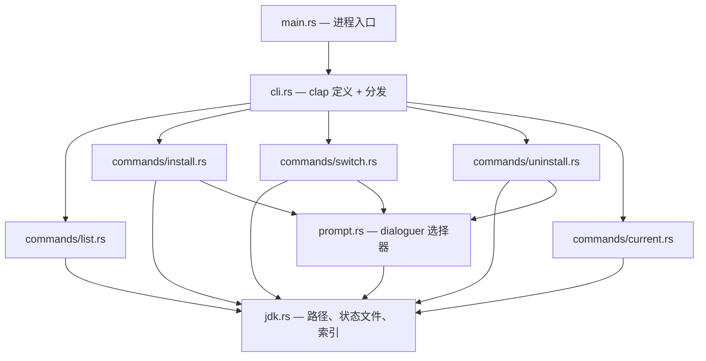

`src/main.rs:9` 就是全部入口——`cli::Cli::parse().run()`。参数解析、分发与 `after_help` 文本都在 `src/cli.rs:73`，这就是新增命令永远不用改 `main.rs` 的原因。

分发本身很薄：`Cli::run` 把一个枚举变体映射成一次 `run()` 调用（`src/cli.rs:74`）。其中唯一的逻辑是 `install` 先断言 spec 非空，然后循环对每个 spec 调用一次 `install::run`（`src/cli.rs:81`）——因此多 spec 安装是顺序执行而非并行，且第一个失败会中止后续。

## 3. 运行时状态

### 3.1 运行时目录的解析

`jdks_base()`（`src/jdk.rs:12`）按以下顺序确定基目录：

1. 若设置了 `%JIR_HOME%` 则用它；
2. 否则用「正在运行的可执行文件所在目录」下的 `home`；当可执行文件路径无法确定时退回 `.`（`src/jdk.rs:16`）。

该值每次调用都重新计算，而不是缓存到全局，因此进程不存在初始化顺序问题。因为第 2 条是从 `current_exe()` 推导而非编译期常量，二进制里永远不会固化绝对安装路径。

### 3.2 目录布局

```text
<home>/
├── 21/
│   └── temurin/          已安装的 JDK（真实目录）
├── 17/
│   └── zulu/
├── occupy              → 指向当前 JDK 的 junction/符号链接   (occupy_dir)
├── .jir-current          标记文件：当前 JDK 的 spec           (current_marker)
├── .meta/
│   └── temurin-21.json   某个 JDK 的厂商/构建元数据
├── .tmp/
│   └── 21-temurin/       解压暂存目录，成功后删除
└── installers/
    └── <文件名>.msi      非 zip 归档，保留下载件供手动安装
```

| 路径 | 由谁写入 | 实现要点 |
| --- | --- | --- |
| `<version>/<distro>/` | `install` | 它的存在**就是**「已安装」的定义——没有任何注册表文件可能与文件系统不一致。 |
| `occupy` | `use` | `JAVA_HOME` 只需要引用这一个路径（`src/jdk.rs:23`）。 |
| `.jir-current` | `use` 写入、`uninstall` 删除 | 刻意放在 `occupy` 的同级而非其内部，因此激活永远不会写进被托管的 JDK（`src/jdk.rs:29`）。 |
| `.meta/<distro>-<version>.json` | `install`、`use` | 同卷缓存；让 `ls`/`use`/`current` 无需索引即可解析厂商名（`src/jdk.rs:120`）。 |
| `.tmp/<version>-<distro>/` | `install` | 与最终目标同级，因此「转正」是同卷 `rename`（`src/commands/install.rs:198`）。 |
| `installers/<文件名>` | `install` | 仅在 `archive_type != "zip"` 时进入（`src/commands/install.rs:60`）。 |

### 3.3 标记文件

`current_info()`（`src/jdk.rs:40`）读取 `.jir-current`；若读失败，则回退到旧版本写在 JDK 内部的遗留位置 `occupy/.jir-current`（`src/jdk.rs:34`）。格式为两行：

```text
21:temurin
Temurin
```

厂商行是可选的。`parse_marker()`（`src/jdk.rs:47`）对空行或纯空白首行返回 `None`，在没有第二行时返回 `(spec, None)`，这正是旧版本写出的标记仍可读的机制。`clear_current()`（`src/jdk.rs:75`）会同时清除两个位置，避免升级后残留旧标记。两处读取都只是 `read_to_string`——这就是 `jir current` 从不访问网络（`src/commands/current.rs:22`）背后的机制。

### 3.4 元数据记录

`JdkMeta`（`src/jdk.rs:114`）是从 `.meta` JSON 填入的两字段结构（`firm`、`java_version`）。`read_meta()` 在文件缺失**或** JSON 解析失败时返回 `JdkMeta::default()`，因此损坏的记录只会退化为「厂商未知」，而不是报错。`write_meta()`（`src/jdk.rs:140`）刻意做成尽力而为：`Result` 被 `let _ =` 丢弃（`src/jdk.rs:154`），因为写入失败的唯一代价只是将来多一次网络查询。

### 3.5 索引缓存位置

索引缓存刻意放在运行时目录之外，这样当 home 目录只读（例如装在 `Program Files` 下）时依然可用（`src/jdk.rs:186`）。`cache_dir()`（`src/jdk.rs:188`）的解析规则：

| 条件 | 位置 |
| --- | --- |
| 设置了 `JIR_HOME` | `$JIR_HOME/.cache`——隔离的运行时把缓存带在身邊 |
| Windows，设置了 `LOCALAPPDATA` | `%LOCALAPPDATA%\jir` |
| Unix，设置了 `XDG_CACHE_HOME` | `$XDG_CACHE_HOME/jir` |
| Unix，设置了 `HOME` | `~/.cache/jir` |
| 兜底 | `<temp>/jir` |

缓存文件名为 `version-cache.json`（`src/jdk.rs:209`）。

## 4. 核心机制

### 4.1 稳定的 `JAVA_HOME` 靠一层间接，而不是改环境变量

核心机制：`<home>/occupy` 处的一个目录链接，每次切换时重新指向。`JAVA_HOME` 由用户配置一次，指向该链接。

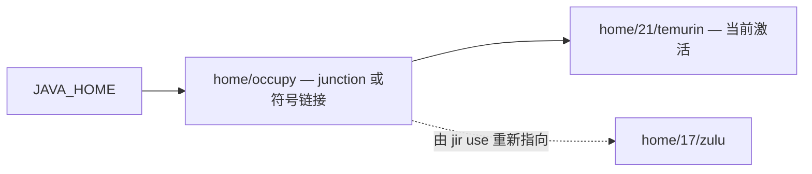

因为切换是 `junction::create` / `symlink`（`src/commands/switch.rs:125`）而不是复制，其开销与 JDK 体积无关。代价是工具从此拥有一个文件系统对象，必须处理它的失败模式：悬空链接，以及更早的「复制式」实现留下的真实目录。两者都在 §4.5 中显式处理。

### 4.2 激活是一次带回滚的切换

「先删后建」不是原子的——中间存在 `occupy` 不存在的窗口。因此实现会在解链**之前**捕获上一个目标，以便新建链接失败时恢复它。

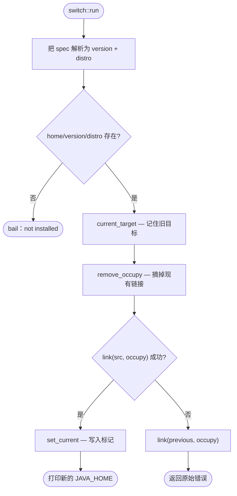

`current_target()`（`src/commands/switch.rs:83`）只在该路径仍然存在时才返回，因此回滚永远不会把链接恢复到已被删除的东西上。恢复本身同样是尽力而为（`src/commands/switch.rs:50` 的 `link(...).ok()`）：向外传播的是原始错误，因为第一个失败才是有信息量的那个。

### 4.3 安装是「先暂存，后转正」

不变量是：解压到一半的 JDK 绝不能看起来像已安装。既然「已安装」等价于「`<version>/<distro>` 目录存在」，解压就必须发生在别处，并以一步完成转正。

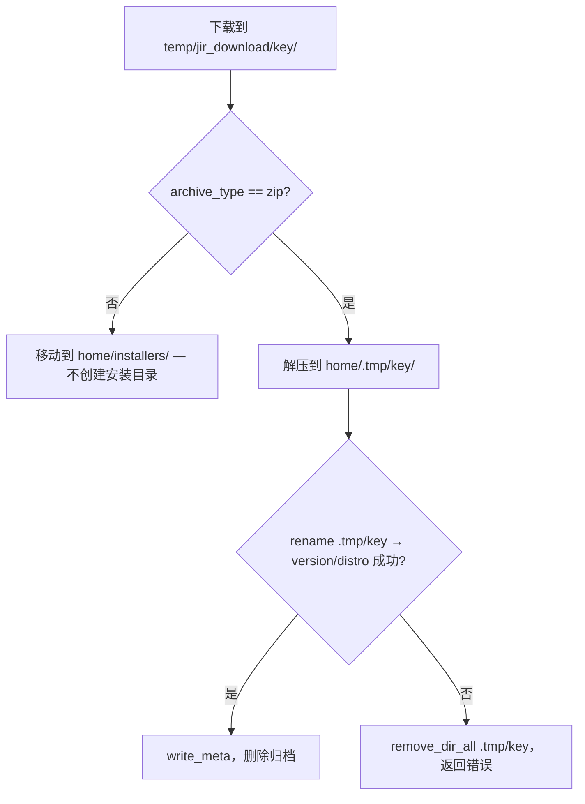

`install_zip()`（`src/commands/install.rs:194`）在解压前会先删除已存在的 `.tmp/<key>`，因此被杀掉的进程留下的残目录不会与新解压内容混合。解压与 `rename` 被放在同一条 `and_then` 链里（`src/commands/install.rs:203`），这意味着**转正**失败同样会触发暂存目录清理，而不只是解压失败才会。

暂存的键是 `<version>-<distro>`（`work_key`，`src/commands/install.rs:123`）。只用发行商作键会让并行的 `17:temurin` 与 `21:temurin` 安装共用同一个目录；两者都用上，则被中断的运行残留的目录仍然可辨认。

### 4.4 下载是流式的、有界的、可重来的

JDK 归档有 100–200 MB，因此连接中断不能意味着从头再来。重试循环上限为三次，并在两次之间删除残包，这样重试的请求不会追加到一个被截断的前缀之后。

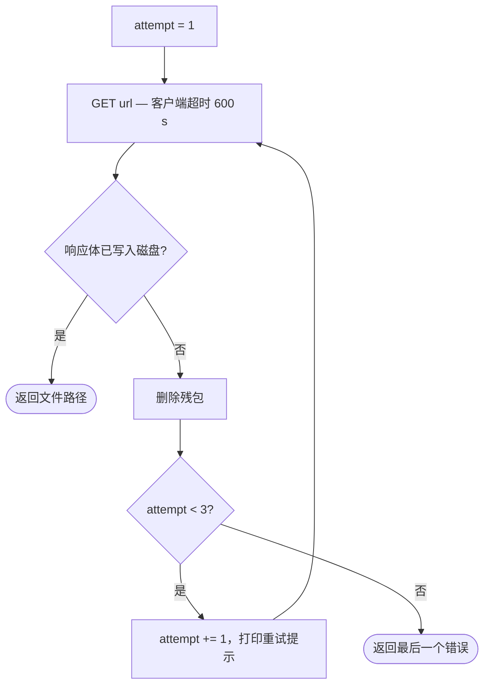

响应体以 64 KiB 分块拷贝（`src/commands/install.rs:168`）而不是整体读入，因此内存占用与归档大小无关，同时进度条按块推进。客户端超时被刻意设得很长——600 秒（`src/commands/install.rs:135`）——而索引是 20 秒（`src/jdk.rs:245`），因为两类请求的载荷相差两个数量级。`fetch_body` 在每条退出路径上都会清除进度条（`src/commands/install.rs:162`），因此失败不会在屏幕上留下半行未绘完的进度条。

`msi`/`exe` 归档走另一条分支：它被移动到 `home/installers/<filename>`，并且刻意**不**创建安装目录（`src/commands/install.rs:56`）。这类归档无法无头解压，因此另一条路——把「下载了安装器」当作「装好了 JDK」——会让 `ls` 和 `use` 报告一个磁盘上并不存在的 JDK。

### 4.5 解链时必须区分链接与目录

`remove_link_or_dir()`（`src/commands/switch.rs:111`）之所以存在，是因为更早的版本用「把真实目录复制到位」来实现切换。对 junction 调用 `remove_dir_all` 会删掉**目标的内容**；对真实目录调用 `remove_dir` 则会失败。判定依据是 `junction::exists()`（`src/commands/switch.rs:114`）：是 junction 就用 `remove_dir` 摘掉，它只移除重解析点；其他情况按旧版真实目录处理，递归删除。

### 4.6 zip 解压：剥离包装目录

厂商归档通常把所有内容包在一个带版本号的目录里（`jdk-21.0.11+10/`）。检测它需要小心：若部分条目位于根目录却仍然剥离前缀，会把目录树悄悄打散。

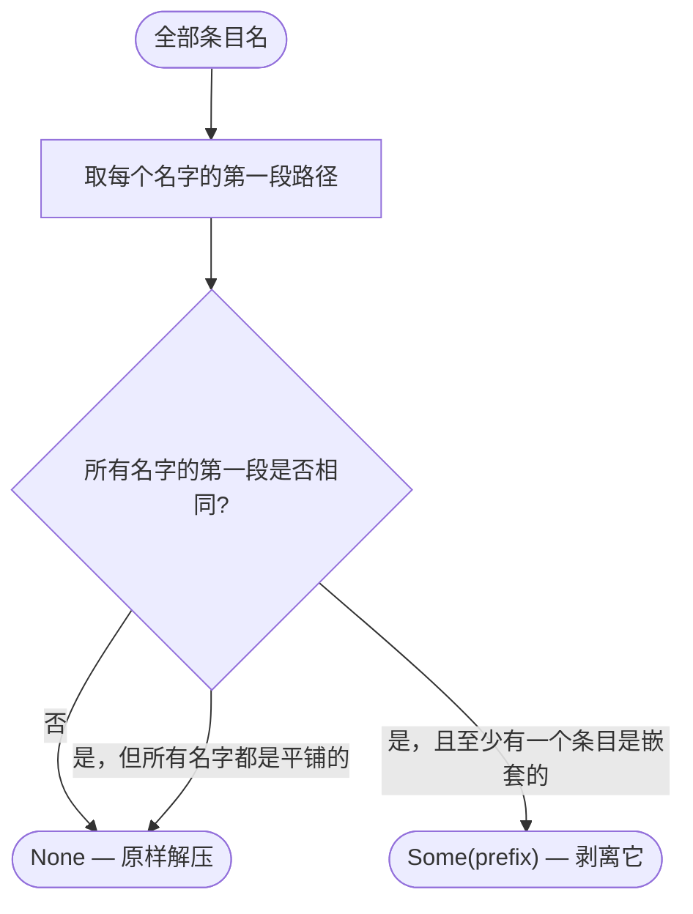

`nested` 标志（`src/commands/install.rs:266`）正是区分「单个包装目录」与「单个根级文件」的关键，这也是空名字列表返回 `None` 的原因。条目名在判断前会先把 `\` 归一化为 `/`（`src/commands/install.rs:220`），因为 zip 条目并不一致地使用正斜杠。剥离按条目应用，前缀不匹配时回退为原始名字（`src/commands/install.rs:233`）。

### 4.7 zip 解压：路径加固

条目名是不可信输入。`safe_relative()`（`src/commands/install.rs:293`）逐组件重建名字，而不是去校验字符串，因此它不依赖识别某种特定写法。

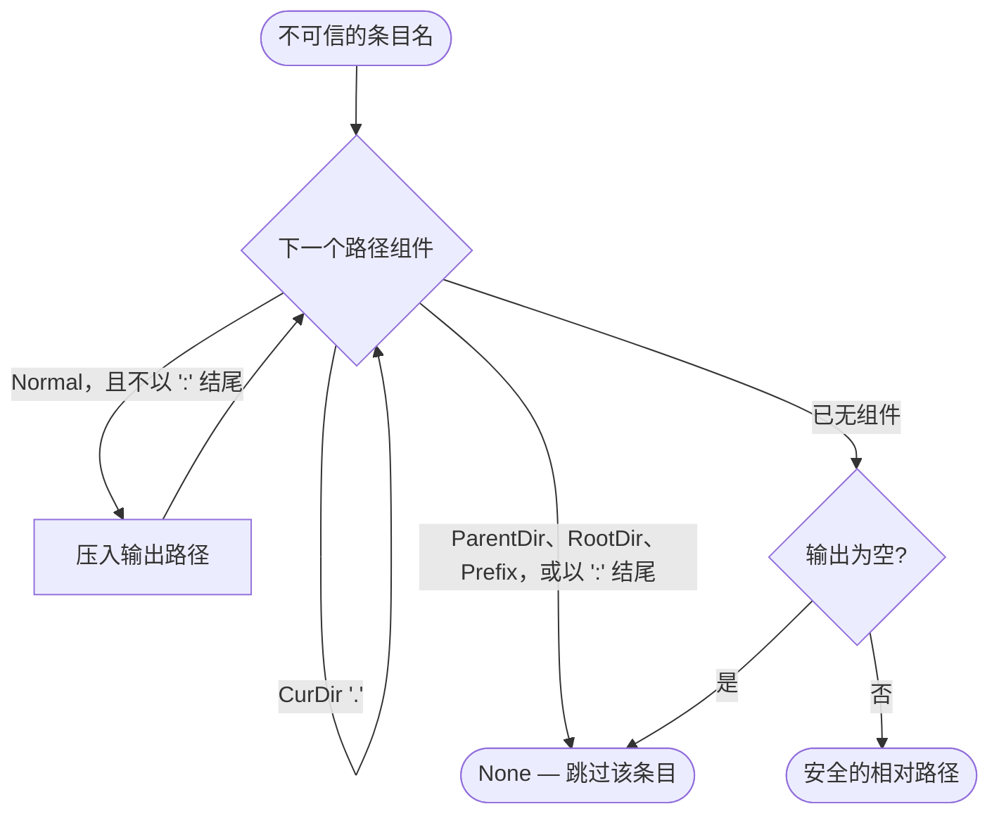

两处细节是刻意的。`CurDir` 是跳过而非拒绝，因为 `./a/b` 是合法条目名；`foo..bar` 会被接受，因为 `..` 只有作为完整组件才危险——判断依据是 `Component::ParentDir`，而不是子串。结尾冒号的检查（`src/commands/install.rs:301`）在每个平台上都能拦住 `C:` 这类盘符相对前缀，而不仅仅是 Windows，因此该保证不取决于编译该 crate 的操作系统。被拒绝的条目会被跳过而不是致命，最后的空输出检查则拦住那些被化简为空的条目。

### 4.8 「已安装」是被发现的，而非被记录的

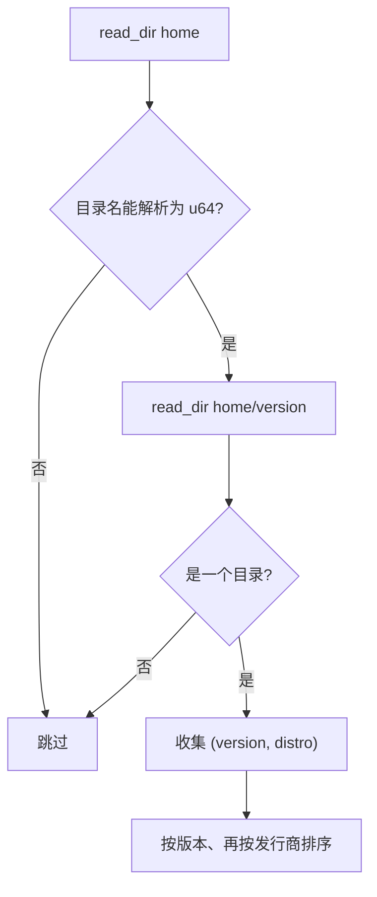

`installed_specs()`（`src/jdk.rs:85`）扫描两层，并用 `parse::<u64>()` 成功与否过滤版本目录（`src/jdk.rs:93`）。这一行正是「目录是唯一真相来源」的实现：`.meta`、`.tmp`、`installers` 与 `occupy` 都无法通过数字解析而被跳过，而写了一半的目录要么完整存在、要么不存在。失败被吸收而非传播——基目录缺失时返回空向量（`src/jdk.rs:88`）。`installed_keys()`（`src/jdk.rs:105`）把同一份数据投影为 `<distro>-<version>` 的 `HashSet<String>`，这正是列表与选择器做 `O(1)` 成员测试所需要的形状。

### 4.9 元数据解析是离线优先的

展示需要厂商与构建号，但获取它们不能成为激活 JDK 的前提。

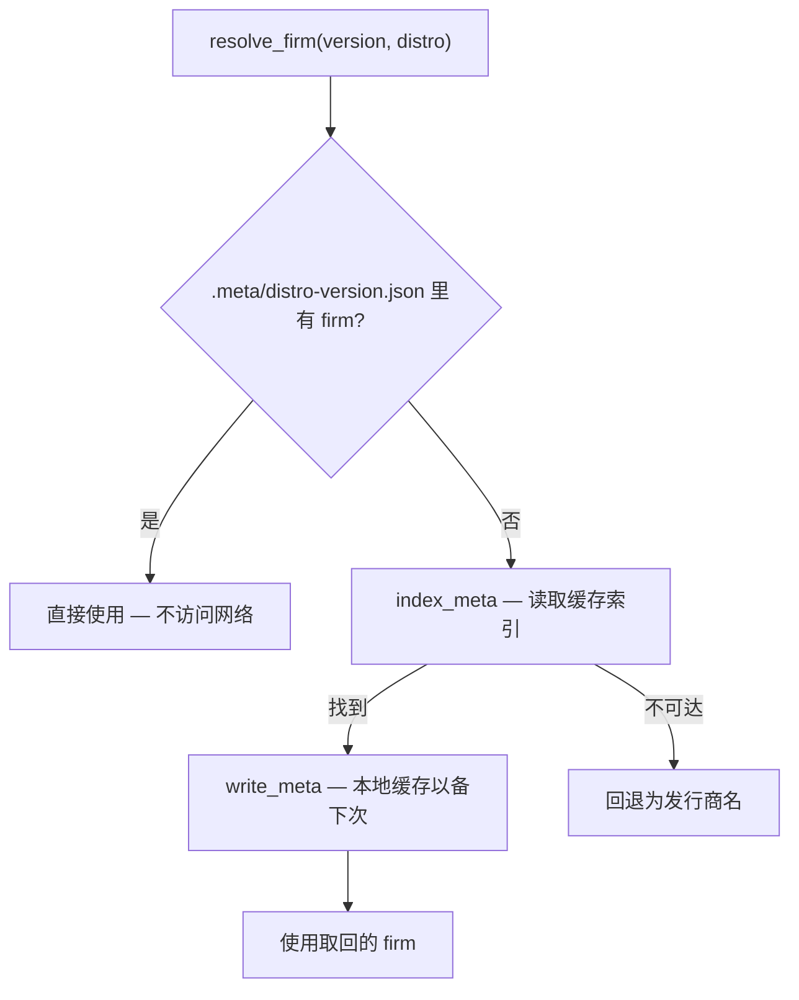

`resolve_firm()`（`src/commands/switch.rs:69`）先试本地元数据，因此凡是由本版本安装的 JDK，激活时都是零网络访问。只有早于元数据文件存在的 JDK 才会回退到索引，而结果会被写回（`src/commands/switch.rs:75`），所以这一代价每个 JDK 最多付一次。最终回退值是发行商字符串本身，这意味着即使索引不可达，离线激活也仍然能成功。

### 4.10 索引加载是三级缓存

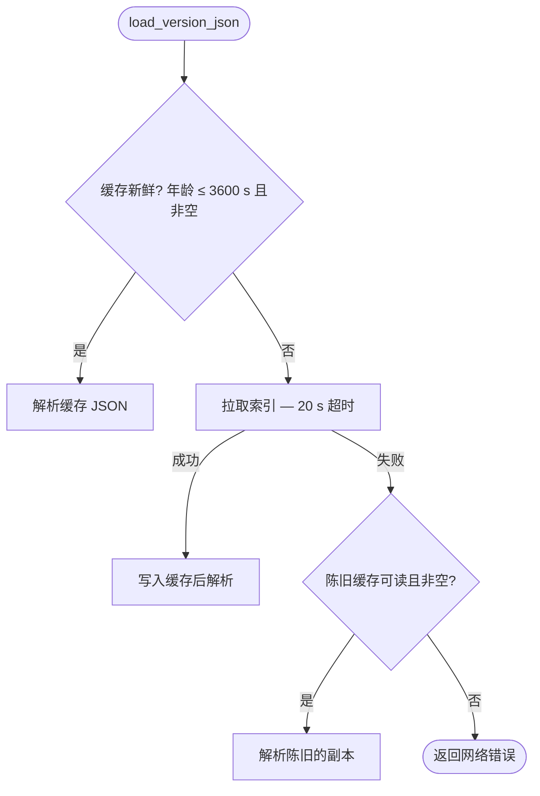

`load_version_json()`（`src/jdk.rs:213`）正是让 `ls -i` 与 `install` 能优雅降级的机制。第 1 级是新鲜度检查：`fresh_cache()`（`src/jdk.rs:235`）要求文件 mtime 在 `VERSION_CACHE_TTL`（3600 秒，`src/jdk.rs:8`）之内**且**内容非空——空文件被视为未命中，这就是被中断的进程写出的截断内容无法污染缓存的原因。第 3 级才是有意思的一级：网络出错时**即使已过期**也会使用陈旧副本（`src/jdk.rs:227`），其判断是「可能过时的索引」比「硬失败」更有用。只有当完全没有可用副本时，原始网络错误才会浮现。缓存写入是尽力而为的 `let _ =`（`src/jdk.rs:222`），因此只读的缓存目录不会让命令失败。

## 5. 索引管线

### 5.1 生产侧

仓库中的 `bat/version.json` 就是发布到客户端所读地址的源文件（`src/jdk.rs:6`）。`bat/update_version_json.py` 负责重新生成它。

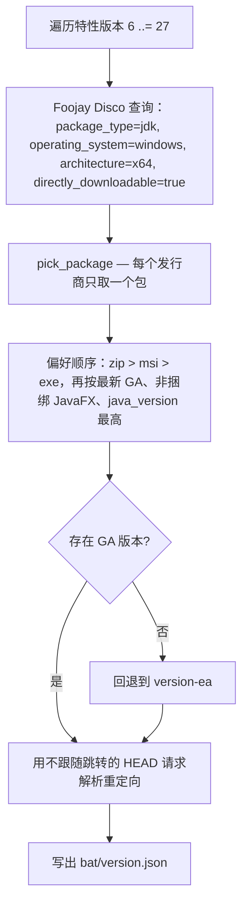

在生成阶段解析重定向，使客户端可以存下直接下载地址，从而省去每次安装的一次往返。

### 5.2 结构与查找

顶层字段（`generated_at`、`source`、`platform`、`architecture`、`package_type`、`selection`、`packages`），然后每个 package 一个对象：

| 字段 | 类型 | 用途 |
| --- | --- | --- |
| `version` | number | 与请求的特性版本精确匹配。 |
| `distro` | string | 发行商键；大小写不敏感匹配。 |
| `firm` | string | 展示名，写入 `.meta`。 |
| `java_version` | string | 构建号，写入 `.meta` 并用于列表展示。 |
| `filename` | string | 下载时落盘的文件名。 |
| `archive_type` | string | 决定走解压路径还是 `installers/` 分支。 |
| `url` | string | 直接下载地址。 |
| `release_status` | string? | 早期访问条目为 `"ea"`；仅作信息展示。 |

`find_package()`（`src/jdk.rs:162`）是一次线性扫描，`version` 精确比较、`distro` 用 `eq_ignore_ascii_case`（`src/jdk.rs:171`）。用线性扫描是刻意的：索引只有几百个条目且每个命令只读一次，为它建索引结构属于过早优化。`install.rs` 按字段逐个读取匹配对象并配 `unwrap_or` 默认值（`src/commands/install.rs:28`），因此某个包即使缺少 `archive_type`，也会按 zip 处理。

## 6. 命令实现

这里只描述控制流与入口，面向用户的语法见 `README.zh-CN.md`。

### 6.1 `list`

`list::run`（`src/commands/list.rs:9`）分成两个完全独立的实现，只在渲染环节汇合：

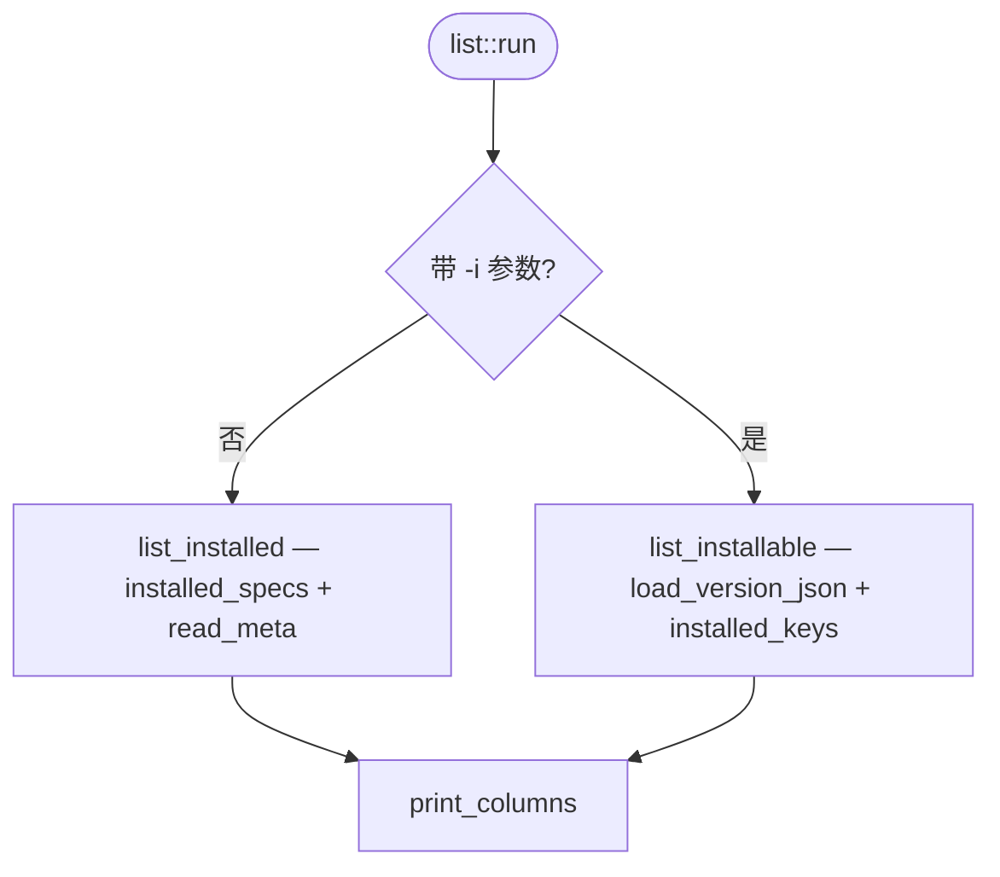

已安装分支只碰文件系统；可安装分支只碰索引加上本地推导出的已安装集合。状态用三个不同字形编码——`*` 激活、`+` 已安装未激活、空白未安装（`src/commands/list.rs:42`）——选它们是为了让列表在不依赖颜色的情况下依然可读。

布局是算出来的而不是写死的（`src/commands/list.rs:113`）：列宽为最长标签加二，列数为 `终端宽度 / 列宽` 且下限为 1，`terminal_size()` 返回空时假定宽度 80（`src/commands/list.rs:117`）。因为列数由宽度推导，窄终端下输出会退化为单列而不会折行错乱。

### 6.2 `install`

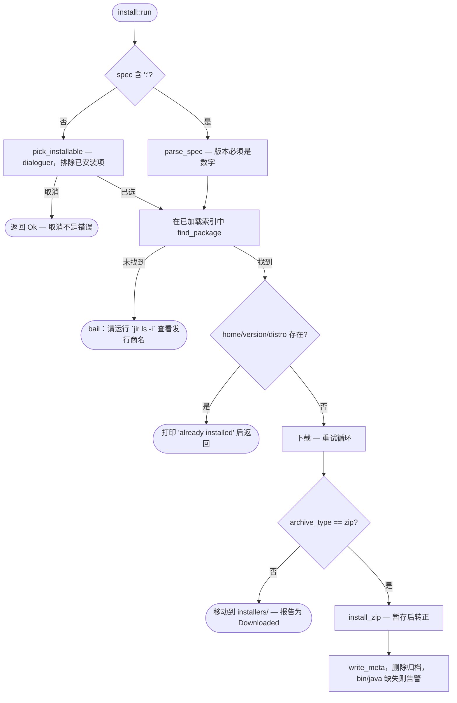

两个提前退出承载了设计意图。`dest_dir.exists()` 检查先于任何网络访问（`src/commands/install.rs:36`），因此重装已有 JDK 不花任何代价，重跑失败脚本也是安全的。而被取消的选择器返回 `Ok(())` 而非错误，因此「取消」与「失败」仅凭退出码即可区分（`src/commands/install.rs:18`）。

`pick_installable()`（`src/prompt.rs:8`）先按版本过滤索引，再按 `installed_key` 成员过滤，因此已安装的发行商永远不会出现在可选项里；当过滤后列表为空时它会 bail 而不是展示空提示（`src/prompt.rs:29`）。选择器使用 `interact_opt()`，其 `None` 结果就是三个调用点都要判定的「取消」信号。

### 6.3 `use`

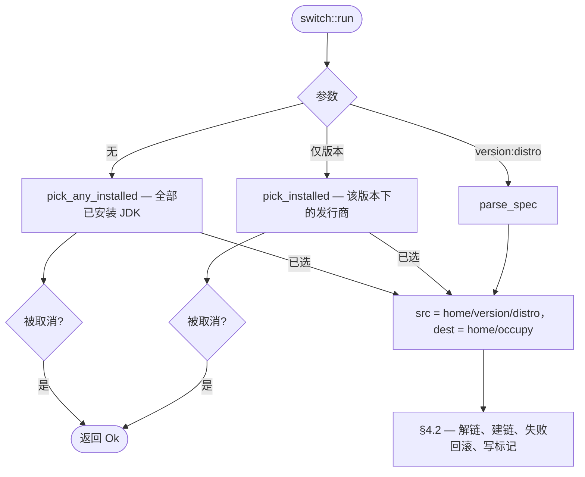

`pick_installed()`（`src/prompt.rs:48`）在某个版本下只有一个发行商时直接返回该候选而不弹提示（`src/prompt.rs:64`），因此常见的单 JDK 场景保持非交互。`pick_any_installed()` 同理（`src/prompt.rs:87`）。

### 6.4 `uninstall`

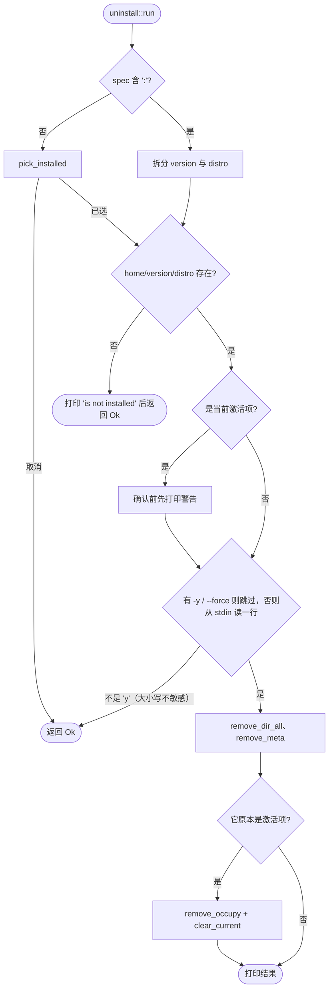

删除不存在的东西会作为信息提示并返回 `Ok(())`（`src/commands/uninstall.rs:29`）——它是幂等的，不是错误。确认需要显式输入 `y`，比较使用 `eq_ignore_ascii_case`（`src/commands/uninstall.rs:52`），因此直接回车即取消。当被删除的正是激活项时，链接与标记都会被清除（`src/commands/uninstall.rs:64`）——标记是被删除而非改写，这使 `JAVA_HOME` 指向一个不存在的路径，即预期的「未设置」状态，随后 `current` 会报告没有激活的 JDK。

### 6.5 `current`

`current::run`（`src/commands/current.rs:6`）是对本地状态的只读投影：标记 → 元数据 → 路径解析。厂商按标记 → `.meta` → 发行商名逐级回退（`src/commands/current.rs:24`），`bin/java` 的检查用 `cfg!(windows)` 选扩展名（`src/commands/current.rs:21`），二进制缺失是**被报告**而非被当作错误（`src/commands/current.rs:40`）——该命令的职责就是描述当前状态，包括一个已损坏的状态。

## 7. 错误模型

所有命令都返回 `anyhow::Result<()>`，`main` 同样如此，因此失败会以 `Error: <上下文>` 打到 stderr 并带非零退出码。上下文附加在最知情的那个位置：`parse_spec` 说明期望格式，`find_package` 指向索引列表，`switch::run` 指向已安装列表（`src/commands/switch.rs:32`）。

有三类情况被刻意**不**视为错误，它们都返回 `Ok(())`：

| 情况 | 理由 |
| --- | --- |
| 交互选择被取消 | 这是用户意图，不是失败（`src/commands/install.rs:18`、`src/commands/switch.rs:13`）。 |
| 该包已安装 | 重跑应当安全且为无操作（`src/commands/install.rs:36`）。 |
| 卸载不存在的东西 | 已处于期望状态（`src/commands/uninstall.rs:29`）。 |

反过来，若干写入被刻意做成尽力而为并吞掉错误——`.meta` 写入（`src/jdk.rs:154`）、缓存写入（`src/jdk.rs:222`）、回滚重建链接（`src/commands/switch.rs:50`）。这些情况下辅助步骤的失败并不使主要结果失效，把它暴露出来只会让一个成功的命令变成失败的命令。

## 8. 测试策略

测试是紧邻被覆盖代码的内联 `#[cfg(test)]` 模块，且只针对纯函数，而不是磁盘上的行为：

| 位置 | 被测函数 |
| --- | --- |
| `src/jdk.rs:256` | `installed_key` 形态；`parse_marker` 含无厂商的旧格式与纯空白拒绝；`fresh_cache` 拒绝缺失、空与新鲜文件。 |
| `src/commands/install.rs:313` | `parse_spec`；`safe_relative` 的穿越用例表——含 `foo..bar` 被接受与 `C:/…` 被拒绝；`work_key` 对版本**与**发行商都唯一；`shared_wrapper` 的包装目录、混合根级、单个平铺文件与空列表四种情形。 |
| `src/commands/switch.rs:139` | `parse_spec` 要求发行商，且容忍空白。 |

选这些是有原因的：路径安全规则、标记的向后兼容、包装目录剥离判定与暂存键，这几处一旦答错都是静默且具破坏性的。其余都是 I/O 组合，类型系统与编译器已经约束住了。

## 9. 平台差异

| 关注点 | Windows | Unix |
| --- | --- | --- |
| 创建链接 | `junction::create`（`src/commands/switch.rs:128`） | `std::os::unix::fs::symlink`（`src/commands/switch.rs:133`） |
| 识别链接 | 解链前用 `junction::exists`（`src/commands/switch.rs:114`） | 无对应物；该路径按真实目录处理 |
| 二进制检查 | `bin/java.exe`（`src/commands/current.rs:21`） | `bin/java` |
| 缓存目录 | `%LOCALAPPDATA%\jir`（`src/jdk.rs:194`） | `$XDG_CACHE_HOME/jir`，否则 `~/.cache/jir` |

差异被限制在三个函数内的 `#[cfg(...)]` 块里，因此上面的命令与状态逻辑与平台无关。有一处刻意的例外：`safe_relative` 中结尾冒号的拒绝**没有**加平台门控，因此归档安全保证在两个平台上完全一致，尽管只有其中一个有盘符概念。

索引本身只为 Windows x64 生成（`version.json` 中的 `platform` / `architecture`），这也是归档类型分支围绕 Windows 安装包展开的原因。

## 10. 扩展点

- **新增发行商**无需改代码：只要 `bat/update_version_json.py` 采集到它，并在重新生成的 `version.json` 发布后即可用。`distro` 值会自动成为 spec 后缀。
- **新增归档格式**是 `install.rs` 的改动：把 `archive_type != "zip"` 分支（`src/commands/install.rs:56`）扩展为真正的解压路径，并保持「先暂存再转正」的模式，使半成品永远不会被发现为已安装。
- **新增命令**只需在 `Commands`（`src/cli.rs:28`）加一个 variant、在 `src/commands/` 下新增带 `run()` 的模块，并在 `Cli::run`（`src/cli.rs:74`）加一个分支。`main.rs` 永远不用改。
- **新增状态字段**应放进 `.meta` 而不是新开文件：`read_meta` / `write_meta` 已经容忍未知键与缺失键。
